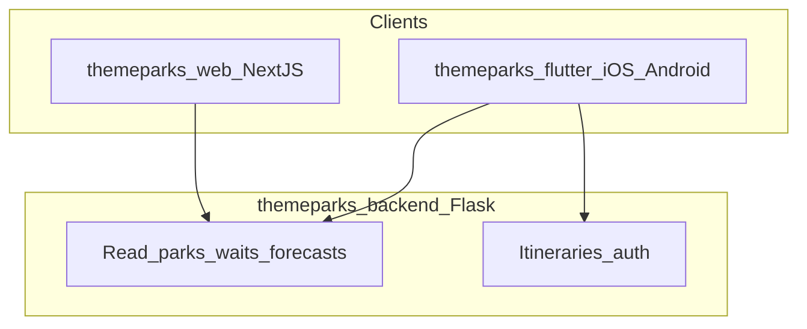

# Platform split — ThemeParks clients

Canonical reference for how **themeparks-web** (Next.js) and **themeparks_flutter** (mobile) divide product scope. Both consume the same Flask backend documented in [API_INTEGRATION_GUIDE.md](https://github.com/themeparks/themeparks-backend/blob/main/API_INTEGRATION_GUIDE.md) (sibling repo: `themeparks-backend`).

**Related UX docs**

| Doc | Repo | Purpose |
|-----|------|---------|
| [UX_INFORMATION_ARCHITECTURE.md](./UX_INFORMATION_ARCHITECTURE.md) | themeparks-web | Web routes and shell |
| [UX_SCREEN_INVENTORY.md](./UX_SCREEN_INVENTORY.md) | themeparks-web | Web page specs |
| [UX_ANALYTICS.md](./UX_ANALYTICS.md) | themeparks-web | Web evaluation surfaces |
| [UX_INFORMATION_ARCHITECTURE.md](../../themeparks_flutter/docs/UX_INFORMATION_ARCHITECTURE.md) | themeparks_flutter | Mobile shell and nav |
| [UX_JOURNEYS.md](../../themeparks_flutter/docs/UX_JOURNEYS.md) | themeparks_flutter | Persona flows |
| [UX_SCREEN_INVENTORY.md](../../themeparks_flutter/docs/UX_SCREEN_INVENTORY.md) | themeparks_flutter | Mobile screen specs |
| [UX_ANALYTICS.md](../../themeparks_flutter/docs/UX_ANALYTICS.md) | themeparks_flutter | Mobile evaluation surfaces |

---

## Three-client model

| Client | Repo | Targets | Primary role |
|--------|------|---------|--------------|
| **Web** | `themeparks-web` | Browser (desktop + mobile web) | Marketing, park meta, analytics, live waits — **no login** |
| **Mobile** | `themeparks_flutter` | iOS, Android | Mobile-first discover + analytics + **auth + itinerary product** |
| **API** | `themeparks-backend` | Cloud Run / local :5000 | Shared data and planner |

**Flutter web is deprecated.** The former Flutter web prototype (`themeparks_flutter/web/`, `flutter run -d web-server`) is replaced by Next.js. Do not add new features to Flutter web.

---

## Feature boundary

| Capability | Web | Mobile | Notes |
|------------|:---:|:------:|-------|
| Marketing / landing pages | Yes | — | Hero, value prop, featured parks |
| Browse parks | Yes | Yes | Web = SEO; mobile = thumb-friendly cards |
| Park meta (hours, location, status) | Yes | Yes | Shared read APIs |
| Live wait times | Yes | Yes | Web = discovery; mobile = discovery + day-of |
| Crowd calendar | Yes | Yes | Strategic “which day?” on both |
| Trends / wait aggregates | Yes | Yes | `GET /wait-times/aggregates` on both |
| Park events / special hours | Yes | Yes | `GET /api/events/{park_id}` |
| Lightning Lane (reference info) | Yes | Yes | From `GET /wait-times/park/{park_id}` access_features |
| Park map | Phase 2 | Yes | Higher value in-pocket on mobile |
| **Login / Signup** | **No** | **Yes** | Web redirects to `/download` |
| **Itinerary generate** | **No** | **Yes** | Web CTA only |
| **Saved trips** | **No** | **Yes** | `GET /api/itineraries?user_id=` |
| **Today / replan** | **No** | **Yes** | In-park product |
| Post-visit crowd feedback | — | Planned | Tied to itinerary ownership on mobile |

**Intentional overlap:** Analytics and live waits exist on **both** platforms so users can research on the web before installing the app, and continue evaluation in the app while planning.

---

## API surface per client

Base URL: `http://localhost:5000` (local) or staging URL from `API_INTEGRATION_GUIDE.md`.

### Web (read-only)

| Endpoint | Purpose |
|----------|---------|
| `GET /health` | Health check |
| `GET /parks` | Browse parks |
| `GET /parks/{park_id}` | Park detail meta |
| `GET /operating_hours/{park_id}` | Hours |
| `GET /operating_hours/{park_id}/summary` | Hours summary |
| `GET /wait-times/park/{park_id}` | Live waits + LL availability |
| `GET /wait-times/aggregates` | Trends / historical analytics |
| `GET /api/forecast/{park_id}/range` | Crowd calendar |
| `GET /api/forecast/{park_id}` | Single-day forecast |
| `GET /api/forecast/compare` | Cross-park compare (optional) |
| `GET /api/events/{park_id}` | Park events |
| `GET /disney/lightning-lane/availability` | LL reference (optional) |

**Web must not call:** `/api/itineraries/*`, `/auth/*`, `POST` ingest or refresh routes.

### Mobile (read + product)

All web read endpoints above, plus:

| Endpoint | Purpose |
|----------|---------|
| `POST /auth/register` | Signup (when implemented) |
| `POST /auth/login` | Login |
| `POST /auth/refresh` | Token refresh |
| `GET /auth/me` | Profile |
| `GET /api/itineraries?user_id=` | Saved trips |
| `GET /api/itineraries/{id}` | Load trip |
| `POST /api/itineraries/generate` | Generate blueprint |
| `POST /api/itineraries/multi-day` | Multi-day (optional) |
| `POST /api/itineraries/{id}/optimize` | Day-of replan |
| `GET /api/itineraries/{id}/replan-status` | Replan watcher |
| `PUT /api/itineraries/{id}` | Update status |
| `DELETE /api/itineraries/{id}` | Delete trip |
| `GET /parks/{park_id}/attraction-coordinates` | Map markers |
| `GET /api/itineraries/preferences/template` | Generation defaults |

---

## Web → app handoff

### Conversion rule

Any user action that implies **planning, saving, or optimizing** a trip on the web redirects to the mobile app. The web **never** implements login, signup, or itinerary flows.

### Redirect routes

| Web path | Behavior |
|----------|----------|
| `/plan` | 301 → `/download` |
| `/account` | 301 → `/download` |
| `/login` | 301 → `/download` |
| `/signup` | 301 → `/download` |

### CTA placement (web)

| Location | Copy (recommended) | Action |
|----------|-------------------|--------|
| Landing hero | “Plan your perfect day — get the app” | Link to `/download` |
| Park hub sticky footer | “Build a personalized itinerary in the app” | Link to `/download?park={id}` |
| Crowd calendar (after date select) | “Plan for {date} — open in app” | Link to `/download?park={id}&date={YYYY-MM-DD}` |
| Trends tab footer | “Turn insights into an optimized day” | Link to `/download` |
| Live waits sidebar | “Get live replans in the park” | Link to `/download` |

### Download page (`/download`)

Required content:

- App Store and Google Play badges (placeholder URLs until listings exist)
- QR code encoding the marketing URL or universal link
- Short “Why mobile?” bullets: saved trips, personalized itineraries, GPS replan, push alerts (future)
- Optional `?park=` and `?date=` query params echoed in copy (“Continue planning for Magic Kingdom on June 12”)

### Deep links (spec — implementation Phase 3)

| Scheme | Example | Use |
|--------|---------|-----|
| Custom URL | `themeparky://plan?park=magic_kingdom&date=2026-06-12` | Post-install handoff from web calendar |
| Universal link | `https://themeparky.com/plan?park=...` | iOS/Android; resolves to app or App Store |

Web calendar and park CTAs should append `park` and `date` query params to `/download` so the download page can surface continuity copy. The mobile app reads the same params on first launch after install (deferred deep link).

### No login on web

- No account menu, session cookies for product features, or JWT storage on web
- Analytics evaluation (waits, calendar, trends) is fully anonymous on web
- Product identity and trip ownership live **only** on mobile

---

## Brand continuity

| Token | Value | Source |
|-------|-------|--------|
| Primary | `Colors.deepPurple` (Material) | `themeparks_flutter/lib/main.dart` |
| Accent | `Colors.blueAccent` | App bars in `home_page.dart`, `park_details.dart` |
| Logo | `themeparky_logo.png`, `themeparky_logo_symbol.png` | `themeparks_flutter/assets/` — copy or symlink into `themeparks-web/public/` at implementation time |
| Tagline | “Plan Smarter, Play Harder” | `home_page.dart` hero |

Web and mobile should feel like one brand; layout patterns differ (desktop nav vs bottom nav).

---

## Flutter web deprecation

| Item | Action |
|------|--------|
| `themeparks_flutter/web/` | Deprecate after Next.js ships; do not extend |
| `start_all_servers.sh` Flutter web on :3000 | Replace with Next.js dev server |
| `flutter run -d web-server` | Remove from default dev workflow |
| Responsive `LayoutBuilder` hacks for wide web | Remove during mobile-first refactor |

Park discovery and analytics previously prototyped in Flutter web move to Next.js per [UX_SCREEN_INVENTORY.md](./UX_SCREEN_INVENTORY.md) migration table.

---

## Environment configuration

| Client | Config |
|--------|--------|
| Web | `NEXT_PUBLIC_API_BASE_URL` (default `http://localhost:5000`) |
| Mobile | `API_BASE_URL` via `--dart-define` (`lib/config/api_config.dart`) |

Both should target the same backend environment (local or staging) during development.

---

## Cross-links

- Backend application architecture: `themeparks-backend/docs/ARCHITECTURE_APPLICATION.md`
- Auth contract (mobile only): `themeparks-backend/docs/AUTH_API.md`
- Auth & evaluation UX: `themeparks-backend/docs/ARCHITECTURE_UX_AUTH.md`
