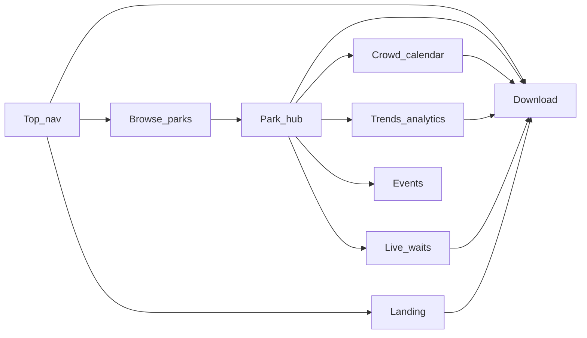

# Web UX — Information Architecture

Next.js marketing and analytics site for ThemeParks. **No authentication.** Product flows (itinerary, saved trips) redirect to the mobile app.

**Canonical platform split:** [PLATFORM_SPLIT.md](./PLATFORM_SPLIT.md)

---

## Product role

The web application answers:

1. **What is ThemeParks?** — Landing and value proposition
2. **Which parks exist?** — Browse and SEO-friendly park pages
3. **What are waits and crowds like?** — Live waits, crowd calendar, trends
4. **How do I plan a trip?** — Download the mobile app (conversion)

The web does **not** answer “build my itinerary” or “save my trip” — those are mobile-only.

---

## UX horizons (web scope)

| Horizon | Web surfaces | User question |
|---------|--------------|---------------|
| **Strategic** | Crowd calendar, best/worst summary | Which day should we go? |
| **Tactical** | Live wait times | What are waits right now? |
| **Analysis** | Trends / aggregates | Can I trust these forecasts? |

Day-of replan and live-vs-plan comparison are **out of scope** on web (no itineraries).

---

## App shell

### Top navigation

| Item | Route | Notes |
|------|-------|-------|
| Logo / Home | `/` | Brand mark links home |
| Parks | `/parks` | Browse all parks |
| Get the app | `/download` | Primary conversion CTA — styled as button in nav |

**Excluded:** Account, Login, My Plan, Today.

### Footer

- Links: Parks, Download, Privacy (placeholder), Terms (placeholder)
- Social / contact placeholders
- “Plan in the app” repeat CTA

### Responsive behavior

| Breakpoint | Layout |
|------------|--------|
| &lt;768px | Hamburger menu; stacked park cards |
| 768–1024px | Collapsed nav or horizontal scroll tabs on park hub |
| &gt;1024px | Full top nav; park hub uses horizontal sub-nav for tabs |

Desktop-first is acceptable for web; mobile web users must reach waits and calendar without horizontal scroll on primary content.

---

## Route map (Next.js App Router)

| Route | Purpose | Auth |
|-------|---------|------|
| `/` | Landing — hero, features, featured parks, download CTA | No |
| `/parks` | Browse parks (search, filter chips) | No |
| `/parks/[parkId]` | Park hub — overview, hours, status, sub-nav to tabs | No |
| `/parks/[parkId]/waits` | Live wait times table | No |
| `/parks/[parkId]/calendar` | 30-day crowd calendar | No |
| `/parks/[parkId]/trends` | Historical analytics (aggregates API) | No |
| `/parks/[parkId]/events` | Park events and special hours | No |
| `/parks/[parkId]/lightning-lane` | LL reference (optional Phase 1.5) | No |
| `/download` | App download — store badges, QR, continuity copy | No |
| `/plan` | **301 → `/download`** | No |
| `/account` | **301 → `/download`** | No |
| `/login` | **301 → `/download`** | No |
| `/signup` | **301 → `/download`** | No |

### Park hub sub-navigation

Park hub (`/parks/[parkId]`) shows park header (name, open/closed, hours) and tab links:

```
Overview | Waits | Calendar | Trends | Events [| Lightning Lane]
```

Default tab: **Overview** (meta + quick stats + CTAs). Tab routes are separate URLs for SEO and shareability.

---

## Sitemap



---

## Page-level information hierarchy

### Landing (`/`)

1. Hero — tagline, primary CTA → `/download`
2. Value props — waits, forecasts, itineraries (in app)
3. Featured parks — cards → `/parks/[id]`
4. Secondary CTA — “Browse all parks” → `/parks`
5. Footer

### Browse (`/parks`)

1. Search + filter chips (All, Disney, Universal, etc.)
2. Park cards — name, location, open/closed, hours snippet
3. Pagination or infinite scroll
4. Each card → `/parks/[parkId]`

### Park hub (`/parks/[parkId]`)

1. Park selector pills (same resort group, e.g. WDW parks)
2. Status badge + operating hours
3. Quick links to waits / calendar / trends
4. Sticky conversion bar — “Plan this park in the app” → `/download?park={id}`

### Sub-routes

See [UX_SCREEN_INVENTORY.md](./UX_SCREEN_INVENTORY.md) for per-page layout and API mapping.

---

## Conversion funnel

```mermaid
flowchart TD
  Visit[Organic_or_direct_visit] --> Landing[Landing_or_park_page]
  Landing --> Evaluate[View_waits_calendar_trends]
  Evaluate --> Intent[User_wants_to_plan]
  Intent --> Download[/download_page]
  Download --> Store[App_Store_or_Play_Store]
  Store --> MobileApp[Flutter_mobile_app]
```

**Micro-conversions** (still success on web):

- Viewed crowd calendar for a park
- Compared trends across days
- Checked live waits before trip

---

## SEO and rendering (implementation notes)

| Page type | Rendering | Rationale |
|-----------|-----------|-----------|
| Landing | SSG or ISR | Fast, cacheable |
| `/parks` | ISR | Park list changes infrequently |
| `/parks/[parkId]/*` | SSR or ISR with revalidate | Park name, waits, forecasts in meta tags |
| `/download` | SSG | Static |

Target meta per park page: `{parkName} Wait Times, Crowd Calendar & Trends | ThemeParks`

---

## Tech stack (spec only — not implemented in docs phase)

| Layer | Choice |
|-------|--------|
| Framework | Next.js App Router |
| API client | TypeScript module mirroring Flutter `BackendAPIService` contracts |
| Charts | Library TBD (Recharts, Chart.js, or similar) — same JSON shapes as Flutter models |
| Styling | TBD — align tokens with deepPurple / blueAccent |
| Env | `NEXT_PUBLIC_API_BASE_URL` |

---

## Migration from Flutter web prototype

| Flutter (deprecated web) | Next.js route |
|--------------------------|---------------|
| `home_page.dart` hero | `/` |
| `browse_parks.dart` | `/parks` |
| `park_details.dart` tabs | `/parks/[id]/*` |
| `crowd_calendar.dart` | `/parks/[id]/calendar` |
| `park_details.dart` `_TrendsTab` | `/parks/[id]/trends` |
| `events_tab.dart` | `/parks/[id]/events` |

**Not migrated to web:** `itinerary_generation.dart`, `itinerary_display.dart`, `today_screen.dart`, auth screens.

---

## Cross-links

- [UX_SCREEN_INVENTORY.md](./UX_SCREEN_INVENTORY.md) — per-page specs
- [UX_ANALYTICS.md](./UX_ANALYTICS.md) — evaluation surfaces
- [PLATFORM_SPLIT.md](./PLATFORM_SPLIT.md) — feature boundary
- Mobile IA: `themeparks_flutter/docs/UX_INFORMATION_ARCHITECTURE.md`
